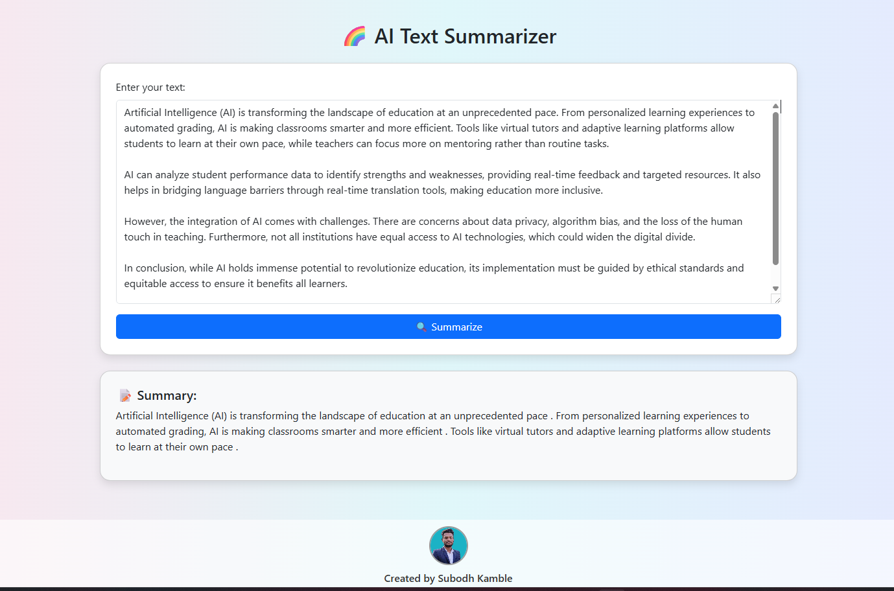

# 🧠 AI Text Summarizer Web App

This is a simple  **AI-powered summarization app** built with **Flask** and **HuggingFace Transformers**. Paste any long paragraph or article, and get a clean, short summary instantly.

---

## 🚀 Features

- 📝 Summarizes large text into short, clear output  
- 🤖 Uses pre-trained **DistilBART model**  
- 🧩 Flask backend with Bootstrap frontend  
- 🌐 Easy to run locally or deploy on cloud  

---
# directly use pretrained model  huggingfaces

## 🧠 Model Details

- **Model:** `sshleifer/distilbart-cnn-12-6`  
- **Type:** Abstractive summarizer  
- **Base:** DistilBART – lightweight version of Facebook's BART  
- **Trained on:** CNN/DailyMail articles  

---

## 📁 Project Structure

summarizer-app/
├── app.py # Flask backend logic
├── templates/
│ └── index.html # Frontend HTML with Bootstrap
├── static/
│ └── styles.css # Optional: Add custom styling
├── requirements.txt # Dependencies
├── README.md # Project documentation

## If you like give a star 